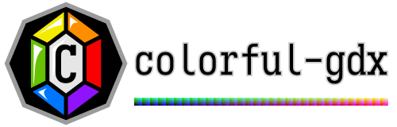

# colorful-gdx
A libGDX mechanism to manipulate colors in powerful ways

Colorful is a small library that mostly offers some predefined shaders and code for handling colors differently from the
normal way. Why would you want this? There are several shortcomings of the default SpriteBatch shader's color handling,
specifically how it handles color tinting with `setColor(float, float, float, float)`:

  - You can use the default setColor() to make an image darker, but never lighter.
  - The default setColor() can't increase any channel's value; that is, if the red channel is 0, then nothing you do can
    make red higher.
  - The ways you can adjust tints don't match any kind of aesthetic way of representing color; you're limited to
    reducing red, green, and blue by some percentage each.

We address this in colorful by representing tint colors differently. While there's some support here for HSLC tints
(hue, saturation, lightness, contrast) via `Shaders.makeBatchHSLC()`, much more of the library focuses on four color
spaces: RGB, YCwCm, IPT, and Oklab. Most of this library's users will only employ one of these color spaces at a time,
and the APIs for all the color spaces are extremely similar. You most likely want to use RGB (because it is the most
compatible with existing colors) and/or Oklab (because it is the most expressive and makes changing colors intuitive).

### RGB

RGB is familiar to almost everyone who works with color on computers; it has a red, a green, and a blue channel, plus
alpha here. The difference between the way an RGB color tint works with a standard libGDX SpriteBatch, and the way one
works here, is that a SpriteBatch is neutral at the value `(1.0, 1.0, 1.0, 1.0)` and can only reduce channels as they go
lower, while here, a ColorfulBatch is neutral at the value `(0.5, 0.5, 0.5, 1.0)` and can lower channels in the same way
or raise channels if they go above 0.5. Typically, RGB is used with the `com.github.tommyettinger.colorful.rgb` package,
with the `ColorfulBatch` class replacing `SpriteBatch`. The `ColorTools` class in the same package provides various
RGB-specific color manipulation, while `FloatColors` in the parent package provides non-specific manipulation of colors
as packed floats (which are the default here). `Palette` has 256 predefined colors from the DawnBringer Aurora palette,
which is well-distributed for almost any pixel art or digital painting, as packed floats that have substantial
documentation. These colors can be accessed with their names via an ObjectFloatMap, `NAMED`, and those names in usefully
sorted orders as `NAMES_BY_LIGHTNESS` and `NAMES_BY_HUE`. There's also `SimplePalette`, which has fewer named colors
predefined, but allows specifying edited and/or combined colors using simple `String`s; more on that later.

Here's an aside about those colors as packed floats. Packed float colors may seem somewhat odd at first, but libGDX
uses them to represent a color in a way that OpenGL can easily handle. They store almost the same info as an RGBA8888
int color, except that they never use or set one bit in alpha (so they really only have 7 bits of alpha, the most
significant ones), and the RGBA bytes are in reversed order. The conversion from int color to packed float color is very
efficient thanks to how the JVM (and GWT, with a caveat) handle this operation. GWT, used for the HTML backend in
libGDX, actually defaults to a very slow conversion between int bits and float, but provides a way for libGDX (or other
libraries) to convert quite efficiently; libGDX does this with its `NumberUtils` class. The `ColorTools` class in each
color space's package provides many ways to manipulate and query packed floats.

`ColorfulBatch` doesn't just provide the option for tints to brighten and darken. It effectively has two batch colors;
one is multiplicative and is called the "tweak," while the regular color is now additive. The changes from the tweak can
lower a channel's value if the tweak has a value less than 0.5 for that channel, or can raise its value if the tweak
has a value greater than 0.5. After the tweak multiplies red, green, and blue, the regular color gets added in (minus
0.5, so low values in the regular color will subtract from the resulting color). There's standard multiplicative alpha
in the regular color, and the tweak's alpha channel adjusts lightness contrast (tweak alpha above 0.5 sharpens contrast,
while tweak alpha below 0.5 makes the image puffy or cloudy). Some games may want to use contrast as a way to highlight
specific areas, with reduced contrast in "background" regions and heightened contrast in important ones. You can combine
multiplicative and additive colors creatively to achieve certain effects; while this is easier with the other color
spaces discussed next, it can be done with RGB as well. Multiplicative colors affect the contribution of the original
texture color to the resulting color, so if you had some randomly-generated colorful static and wanted to make it look
like leaves, you could use a tweak of `(0.2f, 0.6f, 0.0f, 0.3f)` and a regular color of `(0.3f, 0.8f, 0.0f, 1.0f)` to at
least get a bit closer to a leafy background. Because libGDX's `Sprite` class depends on internal details of
`SpriteBatch` that aren't as useful with `ColorfulBatch`, we have a `ColorfulSprite` class here that allows setting its
color and its tweak, but otherwise can be treated like a Sprite. You can still use a `Sprite` with a `ColorfulBatch`,
you just can't set its tweak.

If you don't want to use `ColorfulBatch`, then `Shaders` provides `ShaderProgram` generators and GLSL code for shaders
that handle various color spaces. There are convenient functions that produce ShaderPrograms, like `makeRGBAShader()`
and `makeGammaRGBAShader()`, from the GLSL sources `fragmentShaderRGBA` and `fragmentShaderGammaRGBA`, respectively.
With these, you still use 50% gray as the neutral value, tinting with white brightens, and tinting with black eliminates
all color. However, you don't have the "tweak" that `ColorfulBatch` has, so there's no contrast adjustment with this.
You can use these `ShaderProgram`s with a standard `SpriteBatch`

### YCwCm

Instead of red, green, blue, and alpha channels, YCwCm uses luma (also called lightness), chromatic warmth, chromatic
mildness, and alpha. It's the first color space that was implemented here, and it's still not exactly perfect; there's
no `SimplePalette` here, and sometimes two colors with equivalent luma (as YCwCm calculates it) do not look like they
have the same actual lightness. The chromatic channels are only meaningful together, and can be used to get the
hue and colorfulness (related to saturation) of any individual color. All channels go from `0.0f` to `1.0f` as `float`s,
and can also be viewed as `int`s from `0` to `255` (`254` for alpha, because it is never an odd number). For luma,
`0.0f` is black regardless of chromatic channels, and `1.0f` is white, again regardless. Tinting an image with black
won't actually make the image all black, unlike the default setColor(), but it will make it much darker. Similarly,
tinting an image with white will make the image much lighter (unlike the default, where white makes no change). When you
want to tint with a neutral color, use `batch.setColor(0.5f, 0.5f, 0.5f, 1.0f)` or `batch.setPackedColor(Palette.GRAY)`;
this will make almost no changes to the colors in the textures you draw. For chromatic warmth, `0.0f` is used for colors
from green to blue, while `1.0f` is used for colors from yellow to red. For chromatic mildness, `0.0f` is used for
colors from blue to red, while `1.0f` is used for colors from green to yellow. When both warmth and mildness are `0.5f`,
that represents a grayscale color, which means it makes no change to the hue or saturation of the image drawn. For
alpha, it acts exactly like alpha does normally in SpriteBatch. YCwCm uses a similar naming convention to
[YcbCr](https://en.wikipedia.org/wiki/YCbCr) or [YCoCg](https://en.wikipedia.org/wiki/YCoCg), both close relatives. The
reason this library uses YCwCm instead of YCoCg is that it is comparable in computational cost to transform to and from
RGB, but the luma is somewhat more accurate with YCwCm, and the warmth axis is very useful for aesthetic reasons. As an
example of the aesthetic usage, you could move an image into warm or hot hues when a fire is nearby, or into cooler hues
when the weather is freezing. When warmth is very high, it is also nice to be able to move mildness up and down, which
makes the color mimic that of fire (going from red embers to yellow sparks, spending more time near orange flame).

The YCwCm `ColorfulBatch` has a tweak color, like the RGB `ColorfulBatch`, that can be applied to colors
somewhat-independently of the regular color that can be set with `setColor()`. Where `setColor()` changes the additive
(or subtractive) luma, chromatic warmth, and chromatic mildness, plus multiplicative alpha, `setTweak()` changes:
  - the multiplicative luma (a value from 0.0 to 1.0 that maps to a multiplier from 0.0 to 2.0),
  - multiplicative chromatic warmth and chromatic mildness (two separate values from 0.0 to 1.0 that map to multipliers
    from 0.0 to 2.0, but apply to the current warmth or mildness of a pixel as if they are centered on 0.0, not 0.5),
  - and a contrast adjustment (a value from 0.0 to 1.0 that can make mid-range colors more similar when it is low, or
    separate bright colors into brighter colors and dark colors into darker colors when it is high).

Some useful things to use the tweak for include:
  - Setting the chromatic tweaks to 0.0 will make the rendered color grayscale.
    - If the regular color of a ColorfulBatch isn't gray, then the rendered color will be "green-scale" or some other
      variation of brightness for an existing color.
  - Setting the chromatic tweaks both to values higher than 0.5 will increase saturation/vividness.
  - You can set the chromatic tweaks separately, with 0.0 warmth but 0.5 mildness making all colors somewhere between
    lime and magenta, and 0.0 mildness but 0.5 warmth making all colors between red-orange and cyan.
    - Adjusting one value randomly in small movements over a small range can liven up an effect that seems too slow.
  - Reducing the contrast and increasing the color's lightness will make a misty or foggy effect.
    - You can also change the color to more blue or cyan to make a blue mist, or to pink or purple for "magic fog."
  - Sharply increasing the contrast and increasing luma tweak, optionally changing the color to something thematic, can
    help with an electric shock animation when brief frames, randomly spaced, have the adjustments and other frames have
    darkening or other adjustments.

In the library, there's the basic shader code in `Shaders.java` (and convenience methods that construct SpriteBatch
objects using those shaders), predefined packed-float colors in `ycwcm/Palette.java`, and quite a lot of methods for
manipulating those colors as floats in `FloatColors.java` and `ycwcm/ColorTools.java`. The newer method involving a
tweak requires using a ColorfulBatch instead of a SpriteBatch, but the API is almost the same, and is in
`ycwcm/ColorfulBatch.java`. If you use a ColorfulBatch, you should also use ColorfulSprite instead of Sprite if you want
to set a tweak per-sprite, but even a standard Sprite will render correctly.

The palette used is a slight adjustment on DawnBringer's Aurora palette, a 256-color palette that gets less attention
than his smaller pixel art palettes, but that has excellent coverage of most colors. The names used for colors in it are
very similar to the ones chosen for the palette as used in [SquidLib](https://github.com/SquidPony/SquidLib), though
not identical; some colors have simpler names, like `Green` instead of `Shamrock Green` or `Yellow` instead of `Lemon`.
Naming 256 colors, some of them very similar, was not easy, and some choices are probably odd.

### IPT

The IPT color space is quite similar to YCwCm in some ways, but should have smoother transitions between hues -- after
all, [that's what it was created for](https://www.researchgate.net/publication/221677980_Development_and_Testing_of_a_Color_Space_IPT_with_Improved_Hue_Uniformity)
by Ebner and Fairchild in 1998. It has I (intensity, effectively lightness), P (protan, named after protanopia, or
red-green colorblindness, and corresponding to a cyan-to-red axis), and T (tritan, named after tritanopia, another type
of colorblindness, and corresponding to a blue-to-yellow axis) channels, plus alpha here. In standard IPT, intensity is
very similar for most mid-brightness colors, but falls off suddenly from about 0.3 to 0 in a range of just 1/14 gray to
black. Here, we avoid any `Math.pow()` calculations, which evens out the intensity so 1/10 gray has 0.1 intensity. The
hue and chroma components should be fairly similar, but aren't quite identical. You might want to prefer IPT over YCwCm
if you want color transitions to look as smooth as possible, and don't mind a tiny bit of extra calculation this needs
to do internally. Even with the different calculation for intensity/lightness, most colors that are perceptually similar
in lightness should have similar intensity here.

The `com.github.tommyettinger.colorful.ipt` package has parallels to all the classes in the `ycmcw` package, and the
`ColorfulBatch`, `ColorfulSprite`, and `Palette` classes work almost identically. For ColorfulBatch, this means there's
an additive color, and a multiplicative "tweak," plus multiplicative alpha in the color and contrast in the tweak.

### IPT_HQ

This library provides two variants on IPT; the above version in the `com.github.tommyettinger.colorful.ipt` package is
simpler to compute, while a newer version in the `com.github.tommyettinger.colorful.ipt_hq` package is more faithful to
Ebner's and Fairchild's paper, and gauges the lightness of colors much more accurately. To get a sense of whether you
should use IPT or IPT_HQ, you can compare these palette lists, which are sorted by lightness:
[the above simpler IPT list](https://tommyettinger.github.io/colorful-gdx/ColorTableValueIPT.html), and
[the more-involved IPT_HQ list](https://tommyettinger.github.io/colorful-gdx/ColorTableValueIPT_HQ.html).
IPT has some odd jumps in lightness for red and blue, while IPT_HQ has all perceptually-dark colors in the start of its
list. Using IPT_HQ involves some extra operations that aren't always especially fast, especially when on the GPU, and
they need to be calculated on many fragments. The IPT_HQ shader is still branch-less and isn't much longer than the IPT
shader, so the performance dip is likely to be small.

### Oklab

So, IPT is great when comparing the hues of colors, but isn't optimal when comparing their lightness, or their chroma
(how close or far from being gray they are). The similar, much newer color space Oklab, by Björn Ottosson, was
introduced in [this recent blog post](https://bottosson.github.io/posts/oklab/), and seeks to remedy the mismatch
between hue and the other aspects of color comparison. It has the components L (lightness), A (one chromatic channel,
roughly describing how cool or warm a color is, with high values closer to magenta and low values closer to green), and
B (the other chromatic channel, also in a sense describing something like cool to warm, but with high values closer to
orange and low values closer to blue). It's like a slightly-rotated version of IPT or YCwCm. The main benefits of Oklab
are for comparing colors, where you can use a standard Euclidean distance, and for making smooth gradients. It may also
be a slight bit faster than IPT_HQ, even though its calculations are extremely similar, because Oklab uses a fast
approximation of cube root when it's processed by Java, where IPT_HQ uses a slightly slower call to `Math.pow()` with
0.43 as the exponent. Going in reverse, Oklab can just do `n * n * n` where IPT_HQ needs to use `Math.pow()` again but
also preserve the sign of its argument. This difference probably won't be noticeable in practice, since most color
processing will be done on the GPU for the most intensive applications.

The `com.github.tommyettinger.colorful.oklab` package has parallels to all the classes in the `ipt_hq` package, which
includes those in `ycwcm` and `ipt` as well. Its `SimplePalette` is particularly adept at smoothly changing colors.

### Describing Colors

The `rgb`, `ipt_hq` and `oklab` packages have the same classes present for other color spaces, like those in `ipt`, plus
an extra palette, `SimplePalette`, with a key extra feature. You can use the `SimplePalette.parseDescription(String)`
method to describe a color with a combination of one or more (clearly-named) color names and optionally with adjectives
like "light", "dull", "darker", or "richest". The predefined colors in SimplePalette for IPT_HQ can be previewed in
[this list alphabetically](https://tommyettinger.github.io/colorful-gdx/ColorTableSimpleIPT_HQ.html),
[this list by hue](https://tommyettinger.github.io/colorful-gdx/ColorTableHueSimpleIPT_HQ.html), or
[this list by lightness](https://tommyettinger.github.io/colorful-gdx/ColorTableValueSimpleIPT_HQ.html). The predefined
colors in SimplePalette for Oklab can be previewed in
[this list alphabetically](https://tommyettinger.github.io/colorful-gdx/ColorTableSimpleOklab.html),
[this list by hue](https://tommyettinger.github.io/colorful-gdx/ColorTableHueSimpleOklab.html), or
[this list by lightness](https://tommyettinger.github.io/colorful-gdx/ColorTableValueSimpleOklab.html).

You can use [this small libGDX web app](https://tommyettinger.github.io/colorful-gdx/description/) to experiment with
different descriptions and what they produce. Use the `[` and `]` keys to change modes; there's an RGB, Oklab, IPT_HQ,
and comparison mode. The comparison mode may be the most useful; it has 3 bars that change color using different color
spaces and their SimplePalette transformations.

### HSLC

HSLC doesn't allow changing alpha, so it may be unsuitable for some tasks, but it does allow smooth hue rotations across
the HSL hue range, can saturate or desaturate colors like the two Chroma values can in YCwCm, and has similar luma
adjustment to YCwCm as well. Like with YCwCm, when you tint with all values equal to 0.5f, then the result color
shouldn't change. Raising or lowering hue (stored in the red channel) will rotate the hue away from the input color.
Raising saturation (stored in the green channel) will make the colors more vivid, while decreasing it wll make them
closer to grayscale. Raising lightness (stored in the blue channel) will make colors lighter (it can make them brighter
than the original color if lightness is greater than 0.5), while lowering it will make colors darker. Contrast affects
how rapidly the lightness in input colors changes, so when contrast is high, even slightly different mid-range colors
will have stark lightness differences, while when contrast is low, most lightness will be in the mid-range.

### colorful vs. colorful-pure

Starting with version 0.4.0, there are two similar, but not identical, sub-projects in this repo: colorful, which will
probably be used more frequently, and colorful-pure, which is more specialized. You want colorful if you already depend
on libGDX (currently on version 1.9.13 or higher); it has the useful `ColorfulBatch` and `ColorfulSprite` classes, and
can convert to and from libGDX `Color` objects. If you have a server project, or some other kind of project that doesn't
have a dependency on libGDX, then you might want colorful-pure instead. Instead of libGDX, colorful-pure depends on
[jdkgdxds](https://github.com/tommyettinger/jdkgdxds) for its primitive-backed data structures, and needs Java 8 or
higher (colorful needs Java 7 or higher). Both colorful and colorful-pure produce compatible packed float colors when
they use the same color space, and even though their `Palette` classes use different data structures, the colors in
those palettes are the same. The descriptive color system in `SimplePalette` for the `ipt_hq` and `oklab` packages may
be especially useful in colorful-pure.

## Samples

These all show YCwCm changes.

Tinting with gray as the color causes no change to the original image.


Tinting with black as the color makes it much darker, but keeps very colorful areas where they are.


Tinting with white as the color makes it much lighter, which isn't possible with the default SpriteBatch shader and color representation.


It's a common request to be able to make a Sprite or other texture flash red when a character is hurt; you can tint with the predefined color `Palette.RED` to tint any image to vivid red (including images that have `0.0f` in their red channel).


Tinting with gray, but using a tweak with 0.0 for chromatic warmth and mildness makes the image grayscale.


Tinting with the palette color `WOODLANDS`, but using a tweak with 0.0 for chromatic warmth and mildness makes the image "green-scale."


Tinting with gray, but using a tweak with 1.0 for chromatic warmth and mildness makes the image more saturated.


Tinting with gray, but using a tweak with 0.5 for chromatic warmth and 0.0 for chromatic mildness distorts the colors used.


Tinting with the Palette color `THISTLE`, but using a tweak with about 0.75 luma and about 0.25 contrast achieves the aforementioned "magic fog" effect.


## How to Obtain

Using the Maven Central dependency is recommended, and Gradle and Maven can both depend on this library using that repository.

Gradle dependency (`implementation` should be changed to `api` if any other dependencies use `api`):
```groovy
implementation 'com.github.tommyettinger:colorful:0.6.0'
```

Gradle dependency if also using GWT to make an HTML application:
```groovy
implementation 'com.github.tommyettinger:colorful:0.6.0:sources'
```

And also for GWT, in your application's `.gwt.xml` file (usually `GdxDefinition.gwt.xml`)
```xml
<inherits name="com.github.tommyettinger.colorful.colorful" />
```

If you don't use Gradle, here's the Maven dependency:
```xml
<dependency>
  <groupId>com.github.tommyettinger</groupId>
  <artifactId>colorful</artifactId>
  <version>0.6.0</version>
</dependency>
```

Using colorful-pure is similar:

Gradle dependency (`implementation` should be changed to `api` if any other dependencies use `api`):
```groovy
implementation 'com.github.tommyettinger:colorful-pure:0.6.0'
```

Gradle dependency if also using GWT to make an HTML application:
```groovy
implementation 'com.github.tommyettinger:colorful-pure:0.6.0:sources'
```

And also for GWT, in your application's `.gwt.xml` file (usually `GdxDefinition.gwt.xml`)
```xml
<inherits name="com.github.tommyettinger.colorful.pure.colorful_pure" />
```

If you don't use Gradle, here's the Maven dependency:
```xml
<dependency>
  <groupId>com.github.tommyettinger</groupId>
  <artifactId>colorful-pure</artifactId>
  <version>0.6.0</version>
</dependency>
```

If you don't use Gradle or Maven, [there are jars here](https://github.com/tommyettinger/colorful-gdx/releases/tag/v0.6.0).
